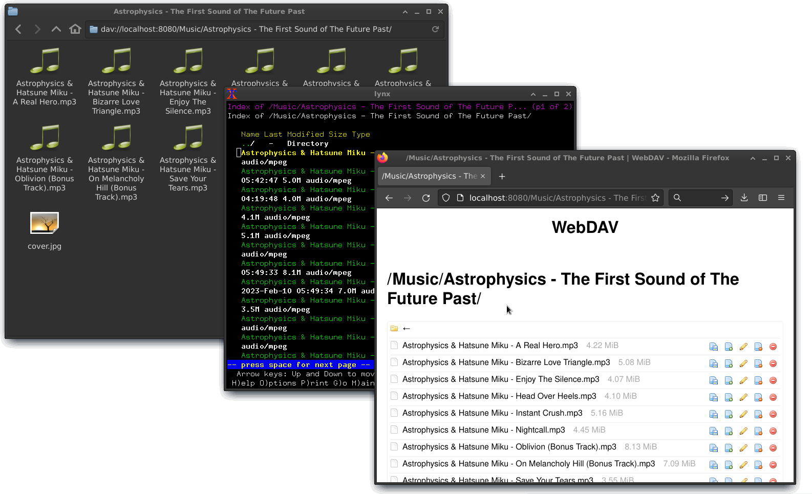

Lighttpd + webdav-js quickstart configuration file
====================================

Base configuration file for quickly setting up a [Lighttpd](https://redmine.lighttpd.net/) webserver with WebDAV support, seamless [webdav-js](https://github.com/dom111/webdav-js) web UI integration for managing files within any modern web browser and a fallback URL prefix serving old-school file indexes

## Prerequisites
 - Lighttpd with mod_webdav and mod_openssl (For HTTPS, you may as well use other SSL library module if you wish)   In Debian/Ubuntu: `apt install lighttpd lighttpd-mod-webdav lighttpd-mod-openssl`
 - A directory of your choice containing the files and subdirectories you want to serve (The WebDAV server root)
 - A separate directory for storing the static webdav-js assets. It is recommended to keep it outside the WebDAV server root   This directory should only contain another directory named `dav-assets`, inside which you should place:
   - The `index.html` file from this repository
   - `webdav-min.js` from [here at the webdav-js repo](https://github.com/dom111/webdav-js/blob/master/src/webdav-min.js)
   - `style-min.css` from [here at the webdav-js repo](https://github.com/dom111/webdav-js/blob/master/assets/css/style-min.css)
   - (Optional) a `favicon.ico` of your choice

## Setting up
 1. Get the `lighttpd-webdavjs.conf` configuration template from this repo and read through the file filling variables as you need where indicated
 2. Try the config: `/usr/sbin/lighttpd -D -f /path/to/your/lighttpd-webdavjs.conf`
 3. Once successfully working, you're all set! You may now use your distro-specific means to set it up as a permanent service. In Debian/Ubuntu overwrite `/etc/lighttpd/lighttpd.conf` with your custom config file
